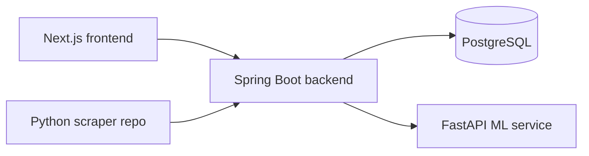

# UFC Fight Predictor

This repository currently contains the Spring Boot backend plus a new Next.js frontend scaffold, with Docker assets under docker/.

## Architecture

## Repository Layout

- `src/` - existing Spring Boot backend
- `frontend/` - Next.js application scaffold
- `docker/` - Dockerfiles and compose files
- `.env.example` - environment variable template

## Local Setup

1. Copy `.env.example` to `.env` and set your local values.
2. Start PostgreSQL and MailHog or run `docker/docker-compose.dev.yml`.
3. Run the backend with Maven from the repository root.
4. Install frontend dependencies in `frontend/` and run `npm run dev`.

## Rollback

- All schema changes should stay in Flyway migrations.
- Roll back by redeploying the previous Docker image.
- If a migration must be corrected, use a new backward-compatible migration instead of editing a published one.

## Suggested Commit Sequence

Backend:

- feat(init): initialise monorepo structure with backend, frontend, and docker folders
- chore(backend): add Spring Boot project with base dependencies
- chore(db): add Flyway and initial schema migration
- feat(auth): implement registration, email verification, JWT login, refresh rotation, and password reset
- feat(security): add CORS, rate limiting, and global error handling
- feat(events): add event and fight controllers
- feat(predictions): add submission, locking, and result processing hooks
- feat(leaderboard): add leaderboard and profile read surfaces
- feat(forum): add forum threads, posts, and moderation endpoints
- feat(notifications): add notification read and mark-read endpoints
- feat(admin): add admin panel endpoints and scraper controls
- feat(health): add health endpoint and service checks
- chore(docker): finalise Dockerfiles and docker-compose files
- docs(readme): add setup, architecture, and rollback documentation

Frontend:

- chore(frontend): initialise Next.js app with TypeScript and Tailwind
- feat(frontend/layout): add dark shell, navigation, and visual system
- feat(frontend/auth): add login, register, verify, and reset pages
- feat(frontend/events): add events listing and event detail pages
- feat(frontend/leaderboard): add leaderboard page
- feat(frontend/profiles): add profile page scaffold
- feat(frontend/admin): add admin panel page scaffold
- feat(frontend/errors): add not-found and error pages