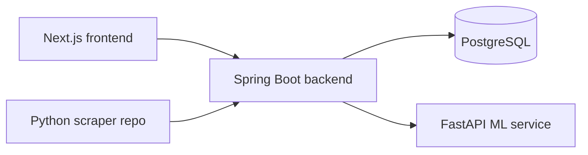

# UFC Fight Predictor

This repository currently contains the Spring Boot backend plus a new Next.js frontend scaffold, with Docker assets under docker/.

## Architecture

## Repository Layout

- `src/` - existing Spring Boot backend
- `frontend/` - Next.js application scaffold
- `docker/` - Dockerfiles and compose files
- `.env.example` - environment variable template

## Local Setup

1. Copy `.env.example` to `.env` and set your local values.
2. Start PostgreSQL and MailHog or run `docker/docker-compose.dev.yml`.
3. Run the backend with Maven from the repository root.
4. Install frontend dependencies in `frontend/` and run `npm run dev`.

## Rollback

- All schema changes should stay in Flyway migrations.
- Roll back by redeploying the previous Docker image.
- If a migration must be corrected, use a new backward-compatible migration instead of editing a published one.

