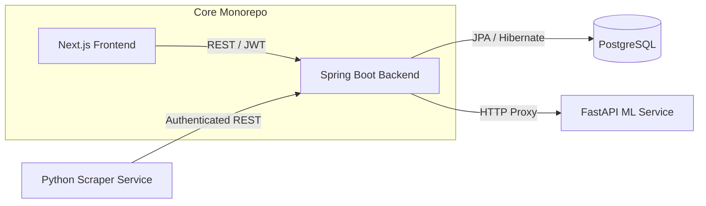

<div align="center">
  <h1>🏆 UFC Fight Predictor</h1>
  <p><strong>A Full-Stack, AI-Powered Web Application for UFC Fight Analysis, Community Predictions, and Live Leaderboards.</strong></p>
  


</div>

<hr />

## 📖 Overview

The **UFC Fight Predictor** is a highly scalable, microservices-oriented web application designed to bring advanced machine learning analytics to MMA fans. 

Users can view upcoming UFC events, participate in community voting, discuss fights in the forum, and submit their own predictions to compete on a global leaderboard against a custom **FastAPI Machine Learning model**.

This repository (`UFC-Fight-Predictor-Website`) serves as the core monorepo, housing both the **Spring Boot REST API** and the **Next.js Web Frontend**. It operates in tandem with external Python scraping and ML microservices.

---

## ✨ Key Features

- 🤖 **AI Predictions Integration**: Connects to a dedicated ML microservice to provide confidence scores and predicted fight winners.
- 🎮 **Fight Simulator**: Interactive simulator allowing users to pit any two fighters from across divisions against each other.
- 🔐 **Robust Security**: Stateless JWT-based authentication featuring secure HttpOnly cookies, refresh token rotation, and BCrypt password hashing.
- 👤 **Advanced User Management**: Comprehensive profile editing, username changes with 90-day cooldowns, and full account deletion with automated data anonymization.
- 📊 **Dynamic Leaderboards**: Tracks user prediction accuracy, win streaks, and total points in real-time.
- 🗣️ **Interactive Forums**: Dedicated discussion threads and community polling for every fight card.
- 🛡️ **Advanced Rate Limiting**: Token-bucket rate limiting implemented via `Bucket4j` and `Caffeine` caching to prevent abuse.
- ⚙️ **Admin Dashboard**: Secure control panel for managing users, roles, fights, and triggering manual ML pre-warming tasks.
- 📧 **Automated Emails**: Integrated MailHog/SMTP setup for registration confirmation and password resets.

---

## 🏗️ Architecture

The application employs a decoupled, multi-repo microservices architecture to ensure scalability and separation of concerns.



### Microservice Ecosystem
1. **[UFC-Fight-Predictor-Website (This Repo)](https://github.com/Vali-Hameed/UFC-Fight-Predictor-Website)**: The primary application containing the user-facing web app and the central data management API.
2. **[UFC-Scraper](https://github.com/Vali-Hameed/UFC-Scraper)**: An isolated Python (BeautifulSoup/Playwright) worker that scrapes live UFC data and pushes updates to the core API securely via `X-Scraper-Key`.
3. **[UFC-Fight-Predictor](https://github.com/Vali-Hameed/UFC-Fight-Predictor)**: A separate Python FastAPI server hosting the trained prediction model.

---

## 📂 Repository Structure

```text
UFC-Fight-Predictor-Website/
├── backend/                  # Spring Boot Java Application
│   └── src/main/java/.../ufcfightpredictor/
│       ├── auth/             # JWT Authentication & Registration
│       ├── config/           # Spring Security & Rate Limiting Configurations
│       ├── ml/               # ML Service Integration & Pre-warming Logic
│       └── models/           # JPA Entities
├── frontend/                 # Next.js 15 App Router Frontend
│   ├── app/                  # Pages, Routing, and Layouts
│   ├── components/           # Reusable React UI Components
│   └── lib/                  # Shared Types and API Fetch Utilities
├── docker/                   # Container Orchestration
│   └── docker-compose.dev.yml# Full stack local development environment
└── README.md                 
```

---

## 🚀 Local Development Setup

The entire stack is containerized for a frictionless developer experience. You do not need Java or Node.js installed locally—only Docker.

### 1. Prerequisites
- **Docker** and **Docker Compose** installed and running.

### 2. Environment Configuration
Copy the template to create your local environment variables:
```bash
cp .env.example .env
```
*(Ensure you modify the `JWT_SECRET` and `JWT_REFRESH_SECRET` in `.env` to be at least 32 characters long for HMAC-SHA algorithms).*

### 3. Spin up the Stack
Run the following command from the root directory to build and start the database, backend, frontend, and mail server:

```bash
docker-compose -f docker/docker-compose.dev.yml up -d --build
```

### 4. Access the Application
Once the containers have finished booting (the Spring Boot API takes ~15 seconds to compile its dependencies on first run), the services will be available at:

- 🌐 **Web Frontend**: [http://localhost:3000](http://localhost:3000)
- 🔌 **Backend API**: [http://localhost:8080](http://localhost:8080)
- 🗄️ **Database**:  [http://localhost:5332](http://localhost:5332)
- 📨 **MailHog (Local Emails)**: [http://localhost:8025](http://localhost:8025)

You can monitor the logs at any time using:
```bash
docker-compose -f docker/docker-compose.dev.yml logs -f
```

---

## 🛠️ Tech Stack

### Frontend
- **Framework**: Next.js 15 (App Router)
- **Language**: TypeScript
- **Styling**: Tailwind CSS & Vanilla CSS modules

### Backend
- **Core**: Java 17, Spring Boot 3
- **Security**: Spring Security 6, JWT, Bucket4j
- **Data Access**: Spring Data JPA, Hibernate
- **Database Migrations**: Flyway

### Infrastructure
- **Deployment**: Hosted on an **Oracle Virtual Private Server (VPS)**.
- **CI/CD**: Fully automated deployment pipelines using **GitHub Actions** via SSH to pull, rebuild, and orchestrate containers.
- **Database**: PostgreSQL 16
- **Containerization**: Docker & Docker Compose
- **Local Testing**: MailHog

---

## 🤝 Contributing

Contributions, issues, and feature requests are welcome! 
Feel free to check the [issues page](https://github.com/Vali-Hameed/UFC-Fight-Predictor-Website/issues) to see what we're currently working on.

If you are looking to run the full end-to-end environment locally, you will also need to clone and run the [UFC-Fight-Predictor](https://github.com/Vali-Hameed/UFC-Fight-Predictor) and [UFC-Scraper](https://github.com/Vali-Hameed/UFC-Scraper) repositories alongside this one.

---

<div align="center">
  <i>Developed by <a href="https://github.com/Vali-Hameed">Vali Hameed</a></i>
</div>
